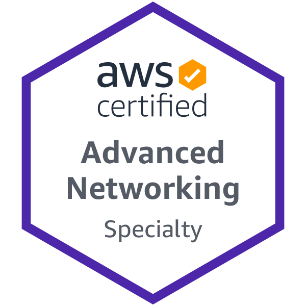

# AWS Certified Advanced Networking – Specialty (ANS-C00) Preparation

This is my preparation notes for the AWS Certified Advanced Networking – Specialty (ANS-C00) exam.  
https://aws.amazon.com/certification/certified-advanced-networking-specialty/

  

 

**170min | Cost $300 | [Online Exam](https://www.aws.training/certification?src=an-spec/)**  
**Version 1.3 ANS-C00**   
  

## AWS ANS-C00 Exam Outline v1.3 

https://d1.awsstatic.com/training-and-certification/docs-advnetworking-spec/AWS-Certified-Advanced-Networking-Specialty_Exam-Guide.pdf

**Domain**	| **Weight** |  
:------- | :-------------|  
Domain 1: Design and Implement Hybrid IT Network Architectures at Scale | 23%  
Domain 2: Design and Implement AWS Networks | 29%  
Domain 3: Automate AWS Tasks | 8%  
Domain 4: Configure Network Integration with Application Services | 15%  
Domain 5: Design and Implement for Security and Compliance | 12%   
Domain 6: Manage, Optimize, and Troubleshoot the Network | 13%  
TOTAL | 100%  

**Domain**	| **Weight** |  
:------- | :-------------|  
**Domain 1: Design and Implement Hybrid IT Network Architectures at Scale** | 23%   
1.1 Implement connectivity for hybrid IT |  
1.2 Given a scenario, derive an appropriate hybrid IT architecture connectivity solution |  
1.3 Explain the process to extend connectivity using AWS DirectConnect |  
1.4 Evaluate design alternatives that leverage AWS DirectConnect |  
1.5 Define routing policies for hybrid IT architectures |  
**Domain 2: Design and Implement AWS Networks** | 29%   
2.1 Apply AWS networking concepts |  
2.2 Given customer requirements, define network architectures on AWS |  
2.3 Propose optimized designs based on the evaluation of an existing implementation |  
2.4 Determine network requirements for a specialized workload |  
2.5 Derive an appropriate architecture based on customer and application requirements  |  
2.6 Evaluate and optimize cost allocations given a network design and application data flow |  
**Domain 3: Automate AWS Tasks**  | 8%  
3.1 Evaluate automation alternatives within AWS for network deployments |  
3.2 Evaluate tool-based alternatives within AWS for network operations and management |  
**Domain 4: Configure Network Integration with Application Services** | 15%  
4.1 Leverage the capabilities of Route53 |  
4.2 Evaluate DNS solutions in a hybrid IT architecture |  
4.3 Determine the appropriate configuration of DHCP within AWS |  
4.4 Given a scenario, determine an appropriate load balancing strategy with in the AWS ecosystem  |  
4.5 Determine a content distribution strategy to optimize for performance |  
4.6 Reconcile AWS service requirements with network requirements   |  
**Domain 5: Design and Implement for Security and Compliance** | 12%  
5.1 Evaluate design requirements for alignment with security and compliance objectives  |  
5.2 Evaluate monitoring strategies in support of security and compliance objectives |  
5.3 Evaluate WS security features for managing network traffic |  
5.4 Utilize encryption technologies to secure network communications |  
**Domain 6: Manage, Optimize, and Troubleshoot the Network**  | 13%  
6.1 Given a scenario, troubleshoot and resolve a network issue |  
TOTAL | 100%  

 

## AWS Documentation
- Main Documentation page:  
https://docs.aws.amazon.com/
  
 

## AWS ANS-C00 Training  

- AWS Exam Readiness:  
https://www.aws.training/Details/Curriculum?id=21330

- Course from "a Cloud Guru":  
https://learn.acloud.guru/course/aws-networking-specialty/learn/  
by Steven Moran & Brock Tubre

 

## AWS ANS-C00 Lab Exercises  

- Whizlabs Labs & Practice exams  
  https://www.whizlabs.com/learn/course/aws-cans-practice-tests  

 

## AWS ANS-C00 Exam Tips

