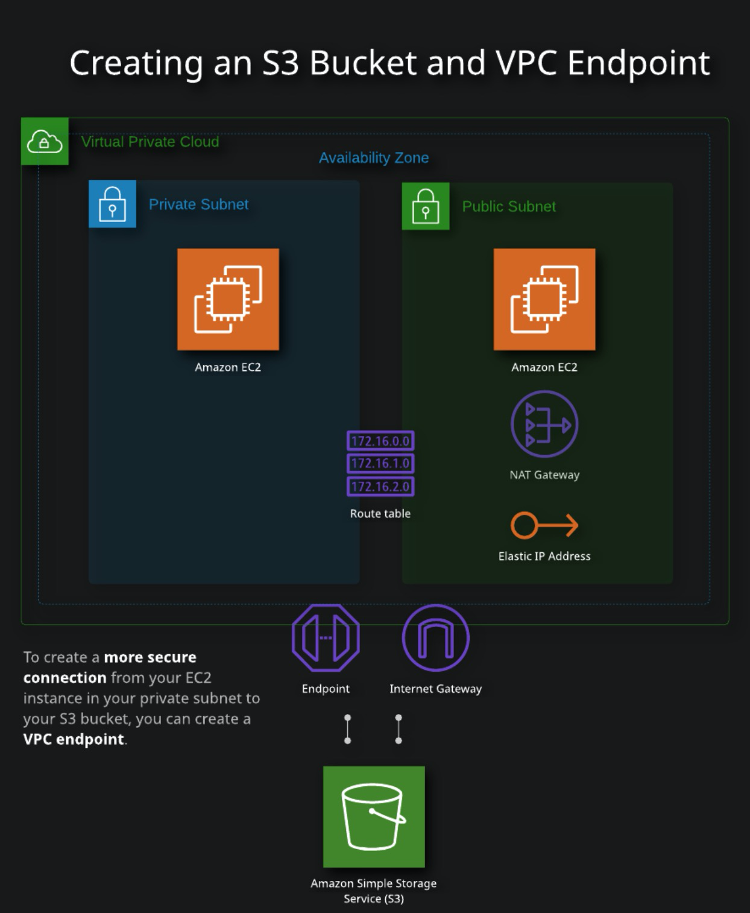

# ACG Lab 2 - VPC Endpoint and S3 Bucket in AWS

## Setup

AWS configuration settings and credentials, using the AWS cli:
```
aws configure
```

Create SSH keys for the EC2 instances:
```
ssh-keygen -C "lab@example.com" -f ssh/key
```

## Terraform 
Terraform config file: 

- [`main.tf`](main.tf) file main set of configuration
- [`variables.tf`](variables.tf) file provides the values for the various CIDR ranges and IP adddresses.
- [`outputs.tf`](outputs.tf) file allows to output the public IP address of the Bastion Host

Initialize and apply the Terraform code:
```
terraform init

terraform apply -auto-approve
```

## Results

Ping and SSH into the PUBLIC EC2 instance:  
```
ping -c1 $(terraform output -raw instance_public_ip)  

ssh -i ssh/key lab@$(terraform output -raw instance_public_ip)
```
From the Bastion host, ping and SSH into one of the PRIVATE EC2 instance:   
```
ping -c1 10.0.1.11

ssh -i key 10.0.1.11  
```  

Verify that the Private EC2 instance can access the S3 bucket via the VPC Endpoint
```  
aws s3 ls
aws s3 ls <object>
```  

---
## Tasks:
- Create an S3 Bucket
- Create a VPC Endpoint
- Verify VPC Endpoint Access to S3

- Create the VPC skeleton
    - Create a VPC with 2 subnets.
- Create the Internet Gateway, then a public and a private route table
    - Create an Internet Gateway and attach it to the VPC. 
    - Create a public route table with a default route to the internet gateway and create a private route table.
- Configure an EC2 instance in the PUBLIC subnet
    - Create the Security Group configuration 
    - Set up the PUBLIC EC2 instance and verify connectivity using SSH.
- Configure an EC2 instance in the PRIVATE subnet
    - Create Security Group configuration necessary to support SSH connectivity between the PUBLIC subnet and the EC2 instance in the private subnet.
    - Create an instance in the private subnet and verify SSH connectivity from the public host.
- Create an S3 bucket with some object in it
- Create a VPC Endpoint for the S3 bucket from the PRIVATE subnet 





