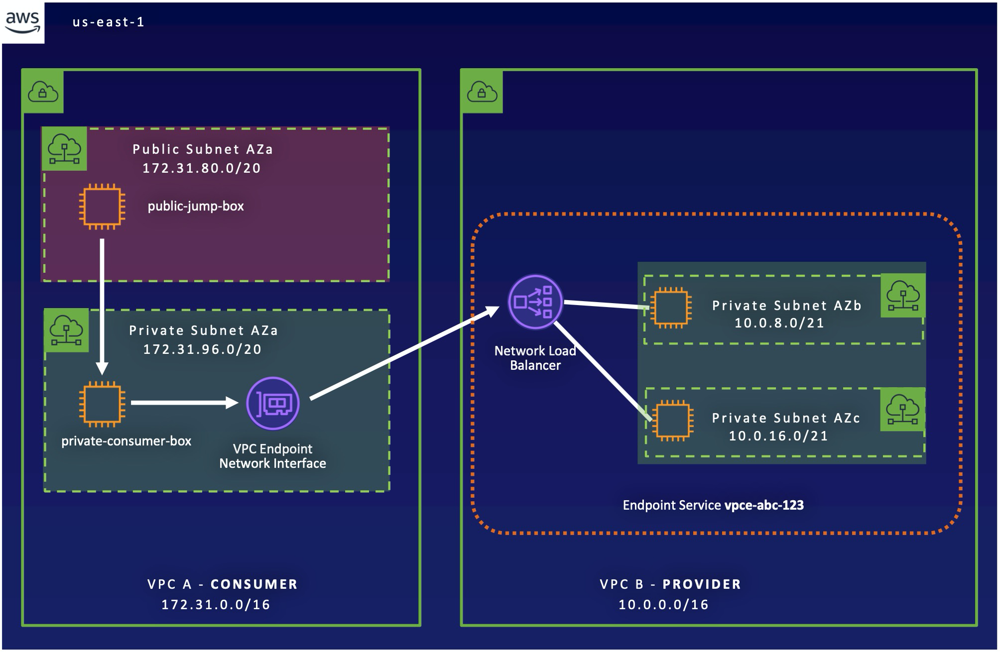

# VPC Endpoint Services 



## Setup

AWS configuration settings and credentials, using the AWS cli:
```
aws configure
```

Create SSH keys for the EC2 instances:
```
ssh-keygen -C "lab@example.com" -f key
```

## Terraform 
Terraform config file: 

- [`main.tf`](main.tf) file main set of configuration
- [`variables.tf`](variables.tf) file provides the values for the various CIDR ranges and IP adddresses.
- [`outputs.tf`](outputs.tf) file allows to output the public IP address of the Bastion Host

Initialize and apply the Terraform code:
```
terraform init

terraform apply -auto-approve
```

## Results

SSH to the Jump box:
```
ping -c 3 $(terraform output -raw instance_public_ip)

ssh -i key ubuntu@$(terraform output -raw instance_public_ip)
```

Ping each web server:
```
ping -c 3 <YOUR-DNS-FQDN>
ping -c 3 www.<YOUR-DNS-FQDN>
```

In your browser, navigate to `www.<YOUR-DNS-FQDN>` and refresh several times the page to verify that the HTTP requests are distributed in a round robin fashion. 

---

## Clean up

Clean up your environment by detroying all traces:

```
terraform destroy
```